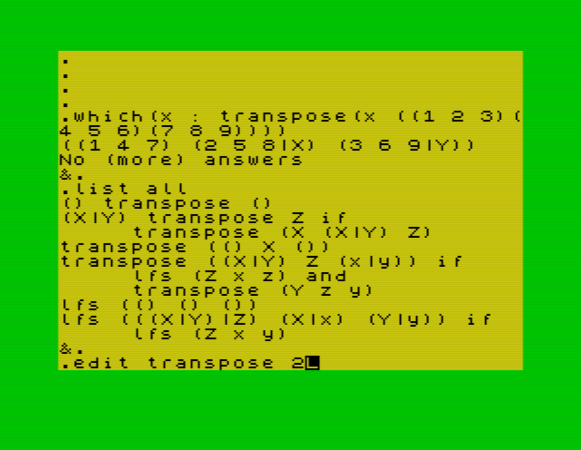

# micro-PROLOG
Disassembled code of SPECTRUM micro-PROLOG T1.0



## 1. Introduction

[Micro-PROLOG](http://www.worldofspectrum.org/infoseekid.cgi?id=0008429) is a variant or dialect of the PROLOG language, initially created for 8-bit microcomputers, popularised in the early 1980s. It was used in public education, usually as an introduction to logic programming and Artificial Intelligence.

The first versions were implemented at Imperial College London, by Frank McCabe and Richard Ennals, under the supervision of Robert Kowalski between 1979 and 1980.

Marketed from 1980 by the British company LPA Ltd (Logic Programming Associates Limited), 8-bit versions were made for several computers, such as the ZX Spectrum, Commodore 64, BBC Micro, MSX and the Apple II, among others. A version for the CP/M operating system was also released.

## 2. Resources

## 2.1 ZX Spectrum version

* [SPECTRUM micro-PROLOG Manual](http://www.worldofspectrum.org/pub/sinclair/games-info/m/Micro-PROLOG.pdf) in PDF
* [SPECTRUM micro-PROLOG Primer](http://www.worldofspectrum.org/pub/sinclair/games-info/m/Micro-PROLOGPrimer.pdf) in PDF
* [The Czech version of the manual](https://sam.speccy.cz/olddocs/microprolog_use-man_cz.pdf)
* [The Purple Planet: Micro-PROLOG for the Spectrum 48K](https://books.google.fr/books?id=kjJdDwAAQBAJ&printsec=frontcover&dq=The+Purple+Planet:+Micro-PROLOG&hl=en&sa=X&ved=0ahUKEwjhyrHH9undAhVmzoUKHS1jDE8Q6AEIKTAA#v=onepage&q=The%20Purple%20Planet%3A%20Micro-PROLOG&f=false), book, incomplete

## 2.2 CP/M version

* [micro-PROLOG Primer](http://oldcomputers-ddns.org/public/pub/manuals/micropro-primer.pdf) in PDF
* [micro-PROLOG 2.12 Programmer's Reference Manual](http://oldcomputers-ddns.org/public/pub/manuals/microprolog.pdf) in PDF
* [micro-PROLOG 2.12 Programmer's Reference Manual - BW](http://oldcomputers-ddns.org/public/pub/manuals/microprolog_bw.pdf) in PDF
* [micro-PROLOG 3.1 Programmer's Reference Manual](http://docplayer.net/4951997-Micro-prolog-3-1-per-gra-er-s-reference-u1-cp-m-and-msdos-versions-f-g-mccabe-k-l-clark-b-d-steel-fourth-edition.html)

## 2.3 Other sources

* [Microcomputer PROLOG implementations: The state-of-the-art](http://www.berghel.com/publications/micropro/micropro_ncc87.pdf) (1987)
* [Logické programování v malém](http://www.abclinuxu.cz/blog/squeaker/2018/10/logicke-programovani-v-malem) (article, Czech)
* [LPA micro-PROLOG v3.1 for DOS](https://archive.org/details/LPAMicro-PROLOGV3.1) 
* [LPA micro-PROLOG v3.2 for DOS](https://archive.org/details/LPAMicro-PROLOGV3.1) (binary only)

## 3. How to compile

### 3.1 Prerequisities

* z80asm
* [skoolkit 6.4](https://pypi.python.org/pypi/skoolkit)
* ZX spectrum emulator, [ZEsarUX](https://github.com/chernandezba/zesarux) recommended 

### 3.2 Compilation

```
z80asm prolog.asm -o prolog-tmp.bin ; bin2tap.py -o 24576 prolog-tmp.bin prolog.tap
```

## 4. Original process of disassembling

### 4.1 Decompilation

```
z80dasm -a -t -l -g 24576 -b blocks.txt prolog.bin > prolog.asm
```
