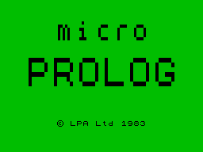

# micro-PROLOG
Disassembled code of SPECTRUM micro-PROLOG T1.0



## 1. Introduction

[Micro-PROLOG](http://www.worldofspectrum.org/infoseekid.cgi?id=0008429) is a variant or dialect of the PROLOG language, initially created for 8-bit microcomputers, popularized in the early 1980s. It was used in public education, usually as an introduction to logic programming and Artificial Intelligence.

## 2. Resources

* [SPECTRUM micro-PROLOG Manual](http://www.worldofspectrum.org/pub/sinclair/games-info/m/Micro-PROLOG.pdf] in PDF
* [SPECTRUM micro-PROLOG Primer](http://www.worldofspectrum.org/pub/sinclair/games-info/m/Micro-PROLOGPrimer.pdf] in PDF

## 2. CP/M version resources

* [micro-PROLOG Primer](http://oldcomputers-ddns.org/public/pub/manuals/micropro-primer.pdf) in PDF
* [micro-PROLOG 2.12 Programmer's Reference Manual](http://oldcomputers-ddns.org/public/pub/manuals/microprolog.pdf) in PDF
* [micro-PROLOG 2.12 Programmer's Reference Manual - BW](http://oldcomputers-ddns.org/public/pub/manuals/microprolog_bw.pdf) in PDF
* [micro-PROLOG 3.1 Programmer's Reference Manual](http://docplayer.net/4951997-Micro-prolog-3-1-per-gra-er-s-reference-u1-cp-m-and-msdos-versions-f-g-mccabe-k-l-clark-b-d-steel-fourth-edition.html)

## 3. How to compile

### 3.1 Prerequisities

* z80asm
* [skoolkit 6.4](https://pypi.python.org/pypi/skoolkit)
* ZX spectrum emulator, [ZEsarUX](https://github.com/chernandezba/zesarux) recommended 

### 3.2 Compilation

```
z80asm prolog.asm -o prolog-tmp.bin ; bin2tap.py -o 24576 prolog-tmp.bin prolog.tap
```

## 4. Original process of disassembling

### 4.1 Decompilation

```
z80dasm -a -t -l -g 24576 -b blocks.txt prolog.bin > prolog.asm
```
