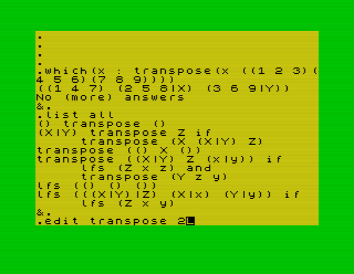

# Sinclair ZX Spectrum micro-PROLOG

This repository preserves the Sinclair ZX Spectrum micro-PROLOG distribution
and contains a literate resurrection of its Z80 interpreter source.

The maintained source is under [`src/`](src/). It is split into thirteen
architecture-oriented modules and assembles to the **exact original 14,200-byte
interpreter image**.



## Build the TAP

### Requirements

- Python 3
- GNU Make
- either **z80asm** or **pasmo**

On Debian or Ubuntu:

```sh
sudo apt install python3 make z80asm pasmo
```

Only one assembler is required for a normal build. From the repository root:

```sh
make
```

The build automatically selects z80asm first, then pasmo. The results are:

```text
build/pcode.bin          byte-exact interpreter image
build/micro-PROLOG.tap   complete loadable distribution tape
```

Select an assembler explicitly when needed:

```sh
make build-z80asm
make build-pasmo
# or:
make ASSEMBLER=pasmo
```

To build with **both** assemblers, compare their outputs, verify the known
SHA-256, and confirm that the reconstructed TAP is byte-for-byte identical to
`tapes/micro-PROLOG.tap`:

```sh
make verify
```

Remove generated files with:

```sh
make clean
```

No external TAP utility is needed. `tools/build.py` assembles the interpreter,
replaces its block in the preserved distribution tape, recalculates the TAP
checksum, and verifies the final file.

## Binary identity

```text
Interpreter address:  0x6000–0x9777
Interpreter size:     14,200 bytes
Interpreter SHA-256:  35cb4bde74ddbfe75875bdfa339e18a7fdf320526f31d2dbcb0862271b5b7174

Distribution TAP size:     53,266 bytes
Distribution TAP SHA-256:  a9908f53eaecc51144e9f059833e7e55f5c7e06ca3c3c512833bf409b4de0d86
```

## Source layout

| Module | Original range | Responsibility |
|---|---:|---|
| `00_definitions.asm` | no bytes | ROM, tags, workspace and structure definitions |
| `01_boot_and_executor.asm` | `6000–6311` | cold start, supervisor restart and evaluator |
| `02_clause_unification_and_allocation.asm` | `6312–6712` | clause selection, frames, unification, trail and allocation |
| `03_garbage_collector.asm` | `6713–6992` | non-moving mark-and-collect garbage collector |
| `04_term_io_and_parser.asm` | `6993–710C` | term output, tokenizer and parser |
| `05_lexical_tables.asm` | `710D–7224` | lexical classifications and variable alphabet |
| `06_devices_and_line_editor.asm` | `7225–7588` | devices, console callbacks, RFILL and line editor |
| `07_type_predicates.asm` | `7589–7662` | type predicates, FAIL and NEW |
| `08_modules_dictionary_and_database.asm` | `7663–7FF4` | cut, modules, dictionaries and relation database |
| `09_graphics_and_machine_io.asm` | `7FF5–83AB` | graphics, sound, keyboard, display and ports |
| `10_supervisor_programs.asm` | `83AC–8B14` | permanent compiled micro-PROLOG supervisor |
| `11_arithmetic.asm` | `8B15–9477` | reversible arithmetic and decimal engine |
| `12_cassette_file_system.asm` | `9478–9777` | cassette file buffering and block I/O |

The source uses descriptive global names for callable routines and permanent
objects, and dot-prefixed local labels for internal control flow. Extensive
comments, pseudocode, and worked examples explain the logical execution core,
including clause retry, unification, trailing, cut, and garbage collection.

## Preserved material

The repository also retains the original historical assets:

- `tapes/` — TAP and TZX distribution images;
- `tape-raw/` and `blocks/` — individual library records;
- `snapshots/` — prepared emulator snapshots;
- `utilities/` — extracted micro-PROLOG utility programs;
- `cpm/` — CP/M disk image;
- `Reference Manual.md` — programmer's reference manual.

## Background and resources

micro-PROLOG is a compact logic-programming system developed for early
microcomputers and marketed by Logic Programming Associates. The ZX Spectrum
edition combines an assembler interpreter with a library of optional programs
such as SIMPLE, MICRO, EDITOR, TRACE, and MODULES.

Useful historical references:

- [ZX Spectrum micro-PROLOG Programmer's Reference Manual](https://archive.org/details/zx-spectrum-micro-prolog-programmers-reference-manual)
- [Spectrum micro-PROLOG manual](https://worldofspectrum.org/archive/software/utilities/micro-prolog-sinclair-research-ltd)
- [The Purple Planet: Micro-PROLOG for the Spectrum 48K](https://books.google.com/books?id=kjJdDwAAQBAJ)

## Original disassembly command

The historical root source was produced with:

```sh
z80dasm -a -t -l -g 24576 -b blocks.txt prolog.bin > prolog.asm
```

The maintained `src/` tree is the subsequent byte-exact semantic
reconstruction, not a fresh linear disassembly.
